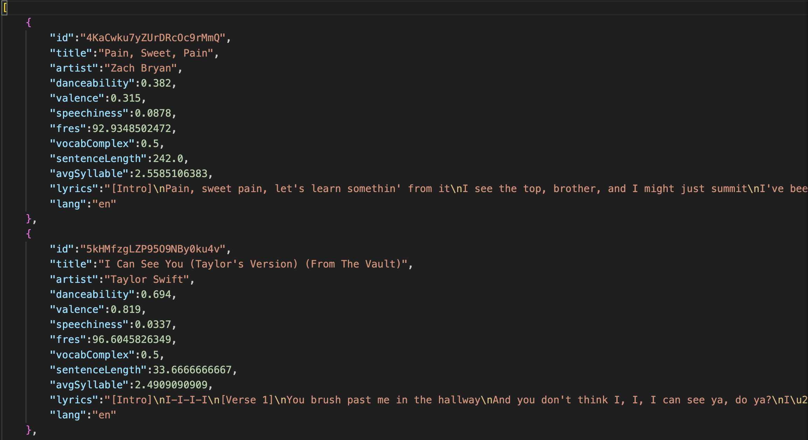

# English Music Recommender
## About
This project aims to create a music recommendation application for non-native English speakers who intend to learn English through the lyrics of English songs. Music is one of the most entertaining and practical approaches to learning a language. People can learn new words and expressions by listening to and singing the lyrics. However, different artists vary in their songwriting choices of words and expressions, which may lead to a difference in the difficulties of comprehending the lyrics for English learners. OpenAI is one of the most useful tools when it comes to recommending people. Therefore, we are creating an application to combine OpenAI with our intention to recommend suitable songs for different levels of learners. On top of that, OpenAI will serve as an English teacher to answer users’ questions regarding the use of English words in the lyrics. 

## How To Play
1. Go to [https://huggingface.co/spaces/si568project2/English_Music_Recommender](https://huggingface.co/spaces/si568project2/English_Music_Recommender)
2. Pick your preferences for the music on the left side
3. Click the `Submit` button
4. The recommendation will show on the same page
5. Go to the right side of the page and interact with OpenAI about the song by choosing one of the prompts or typing in your own

## File Description
| File Name | Description |
| --- | --- |
| data_fetch.py | Fetch and consolidate song data from Spotify, Genius, and Bill Board Hot 100 |
| data.json | The output song data from data_fetch.py |
| app_function.py | Implement OpenAI API |
| choosingdata.py | Filter the dataframe based on user's preference |
| app.py | Display user interface |
| README.md | The instructions for running the code |
| requirement.txt | A list of packages and libraries required for the app |

## Used Third-Party Python Packages
- `BeautifulSoup`
- `requests`
- `nltk`
- `OpenAI`
- `streamlit`
- `langchain`

## Data Structure
As below screenshot shows, the original data retrieved from the APIs is constructed in a DataFrame structure. 

In the `choosingdata.py` file, the data is filtered based on the user's preference:
1. Danceability
2. Valence
3. Difficulty (speechiness, fres, vocabComplex, sentenceLength) - Binned into quantiles to rank the difficulty

According to the user's preference, we will be filtering out a list of songs that match their choice. After filtering the dataframe, it will generate and print a random song from the corresponding dataframe. Users will then be able to ask questions about the song or regenerate for another song.
